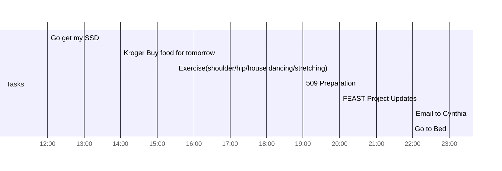

## Day Planner

- [x] 12:00 Go get my SSD
- [x] 14:00 Kroger Buy food for tomorrow
- [x] 15:30 Exercise(shoulder/hip/house dancing/stretching)
- [ ] 19:00 509 Preparation
- [ ] 20:00 FEAST Project Updates
- [ ] 22:00 Email to Cynthia
- [ ] 23:00 Go to Bed

## Others
- [ ] USD Transfer
- [ ] Packing for tomorrow