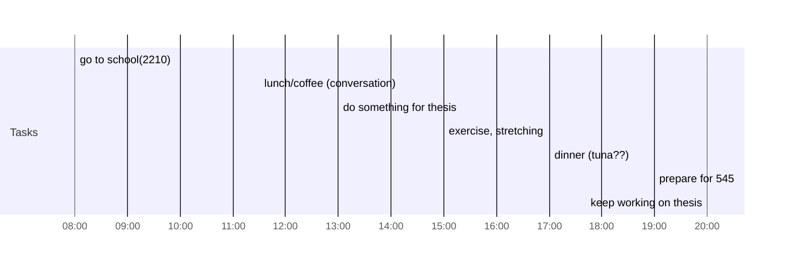

## Day Planner

- [ ] 08:00 go to school(2210)
- [ ] 11:30 lunch/coffee (conversation)
- [ ] 13:00 do something for thesis
- [ ] 15:00 exercise, stretching
- [ ] 17:00 dinner (tuna??)
- [ ] 19:00 prepare for 545
- [ ] 20:00 keep working on thesis
- [ ] 