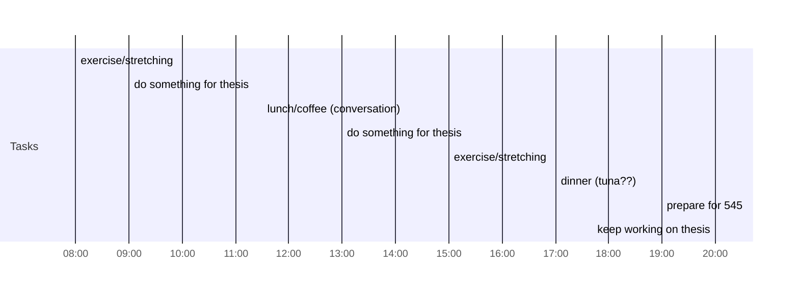

## Day Planner

- [x] 08:00 exercise/stretching
- [x] 09:00 do something for thesis
- [x] 11:30 lunch/coffee (conversation)
- [x] 13:00 do something for thesis
- [x] 15:00 exercise/stretching
- [x] 17:00 dinner (tuna??)
- [ ] 19:00 prepare for 545
- [ ] 20:00 keep working on thesis

## goal
|item|time|
|----|----|
|thesis|6|
|superposition|3|
|exercise|2|
|survive|3|
|rest|2|
