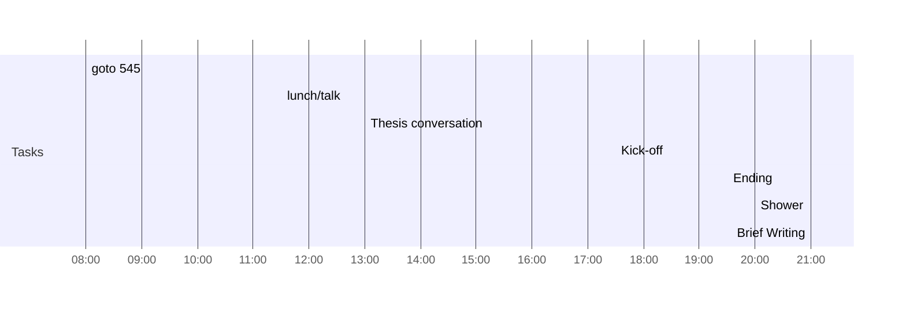

## Day Planner

```mermaid
gantt
    dateFormat  HH-mm
    axisFormat %H:%M
    %% Current Time: 5:13:05 PM
    section Tasks
    goto 545     :08-00, 210mm
    lunch/talk     :11-30, 90mm
    Thesis conversation     :13-00, 270mm
    Kick-off     :17-30, 120mm
    Ending     :19-30, 30mm
    Shower     :20-00, 60mm
    Brief Writing     :21-00, 0mm
    section Breaks

```

- [ ] 08:00 goto 545
- [ ] 11:30 lunch/talk
- [ ] 13:00 Thesis conversation
- [ ] 17:30 Kick-off
- [ ] 19:30 Ending
- [ ] 20:00 Shower
- [ ] 21:00 Brief Writing