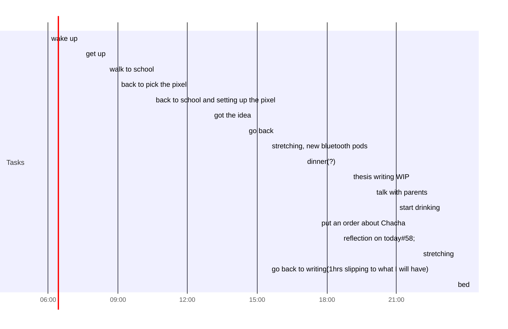

## Day Planner

- [x] 06:00 wake up
- [x] 07:30 get up
- [x] 08:30 walk to school
- [x] 09:00 back to pick the pixel
- [x] 10:30 back to school and setting up the pixel
- [x] 13:00 got the idea
- [x] 14:30 go back
- [x] 15:30 stretching, new bluetooth pods
- [x] 17:00 dinner(?)
- [x] 19:00 thesis writing WIP
- [x] 20:00 talk with parents
- [x] 21:00 start drinking
- [x] 21:30 put an order about Chacha
- [x] 21:55 reflection on today:
	did too much side jobs(entertainment)
- [ ] 22:00 stretching
- [ ] 22:30 go back to writing(1hrs slipping to what I will have)
- [ ] 23:30 bed