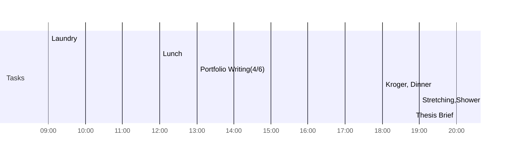

## Day Planner

```mermaid
gantt
    dateFormat  HH-mm
    axisFormat %H:%M
    %% Current Time: 9:14:19 PM
    section Tasks
    Laundry     :09-00, 180mm
    Lunch     :12-00, 60mm
    Portfolio Writing(4/6)     :13-00, 300mm
    Kroger, Dinner     :18-00, 60mm
    Stretching,Shower     :19-00, 60mm
    Thesis Brief     :20-00, 0mm
    section Breaks

```

- [x] 09:00 Laundry
- [x] 12:00 Lunch
- [x] 13:00 Portfolio Writing(4/6)
- [x] 18:00 Kroger, Dinner
- [x] 19:00 Stretching,Shower
- [ ] 20:00 Thesis Brief