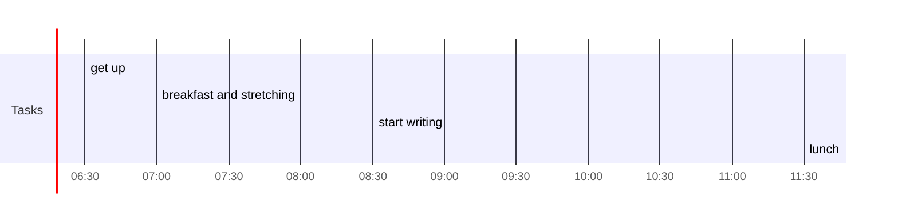

## Day Planner

```mermaid
gantt
    dateFormat  HH-mm
    axisFormat %H:%M
    %% Current Time: 12:02:30 PM
    section Tasks
    get up     :06-30, 30mm
    breakfast and stretching     :07-00, 90mm
    start writing     :08-30, 180mm
    lunch     :11-30, 0mm
    section Breaks

```

- [x] 06:30 get up
- [x] 07:00 breakfast and stretching
- [ ] 08:30 start writing
- [ ] 11:30 lunch
- [ ] 