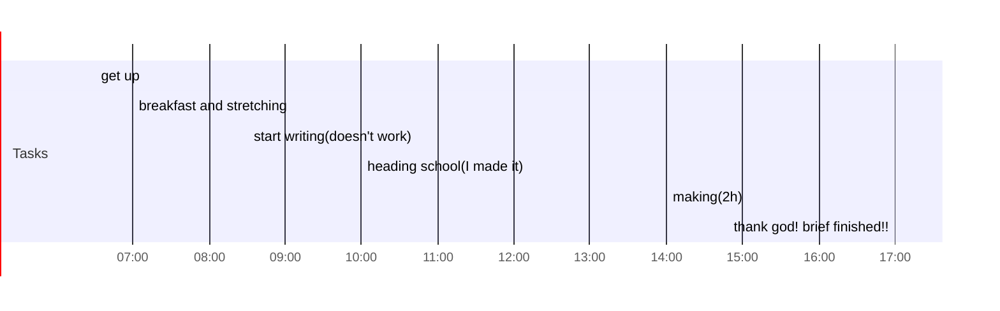

## Day Planner

- [x] 06:30 get up
- [x] 07:00 breakfast and stretching
- [x] 08:30 start writing(doesn't work)
- [x] 10:00 heading school(I made it)
- [x] 14:00 making(2h)
- [x] 17:00 thank god! brief finished!!